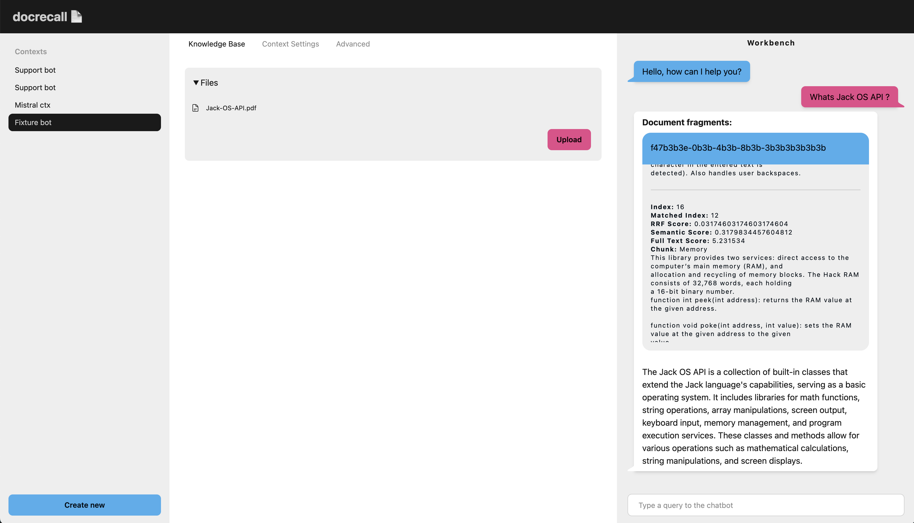

# DocRecall

An experimental AI support system for making private RAG powered internal Slack chatbots with Postgres (ParadeDB) and any Open AI compatible inference engines through LiteLLM.

Next iteration of the https://github.com/grzegorz-bielski/support-bot

## Features
- RAG for documents with **hybrid retrieval** - dense vectors + BM25
- models and prompts customization
- bot contexts for documents, aka projects / workspaces
- admin UI
- slack integration

## Stack
- Scala 3, Cats Effect, sttp, http4s
- langchain4j (document chunking only)
- Postgres (ParadeDB)
- htmx, tailwind 4, daisy-ui

## Possible TODO
- [ ] Eval: https://github.com/confident-ai/deepeval
- [ ] Reranker
- [ ] Original doc storage with minio

### UI QoL:
- [ ] changes ctx name should update the ctx name in the sidebar
- [ ] progress bar should take into account doc processing or there should be a separate progress bar for that
